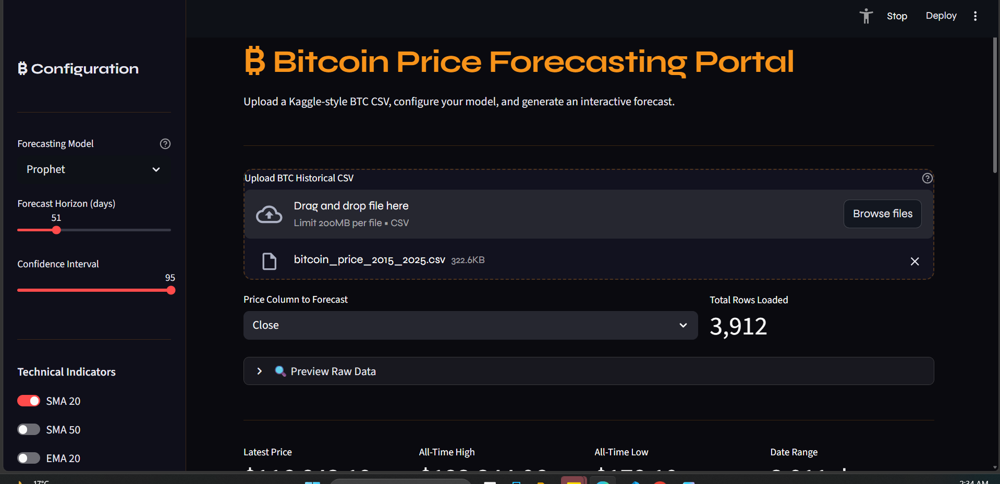
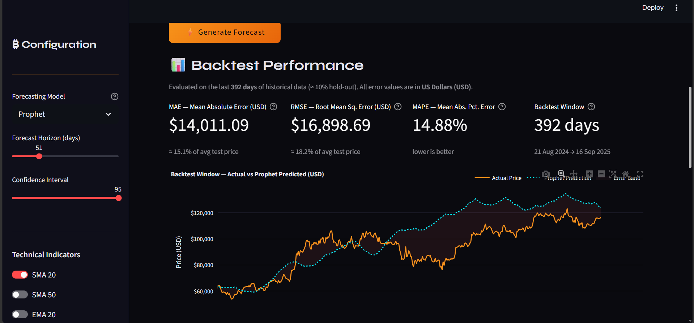
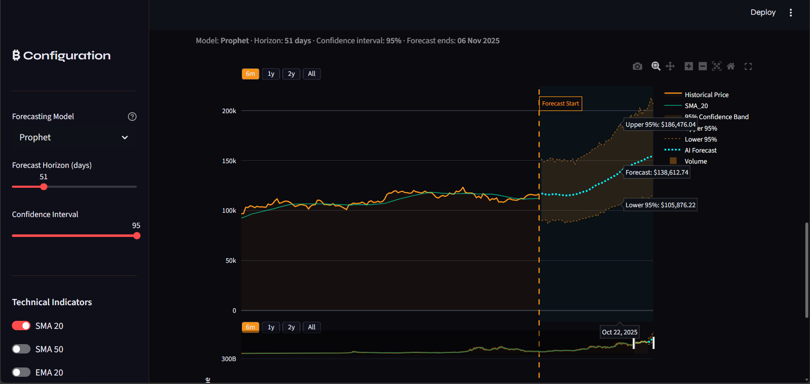

# ₿ BTC Time Series Forecasting Portal


## 🌐 Live Demo

[](https://merna-hany12-btc-time-series-forecasting-app-zrk89p.streamlit.app/)

> **[▶ Open Live App](https://merna-hany12-btc-time-series-forecasting-app-zrk89p.streamlit.app/)**

---

## 🚀 Project Overview

Bitcoin's extreme volatility and regime-shifting behaviour make traditional single-period forecasting models unreliable. This portal implements a **dual-model approach**, allowing users to compare:

- **MSTL + AutoARIMA** — a hybrid decomposition-based statistical model that isolates multiple seasonal cycles before applying autoregressive logic
- **Facebook Prophet** — a robust additive model with log-space variance stabilisation and custom monthly seasonality

The dashboard provides an interactive backtesting UI to evaluate model accuracy on held-out historical data, alongside a forward forecast module for future price projection.

---

## 🧠 Model Architecture

### 1. Hybrid MSTL + AutoARIMA — Primary Model

The core insight behind this model is that ARIMA should never see the raw price series. Instead, MSTL first strips away all deterministic seasonal structure, leaving a near-stationary residual that ARIMA can model cleanly.

#### Decomposition — MSTL

Multiple Seasonal-Trend decomposition using Loess (MSTL) is applied to the full price series before any forecasting takes place. It simultaneously extracts four cyclical patterns:

| Cycle | Period | Rationale |
|---|---|---|
| Weekly | 7 days | Weekend trading volume drops |
| Monthly | 30 days | Institutional rebalancing cycles |
| Quarterly | 90 days | Macro reporting periods |
| Yearly | 365 days | Annual bull/bear market patterns |

The decomposition produces:

```
price(t) = trend(t) + seasonal_7(t) + seasonal_30(t) + seasonal_90(t) + seasonal_365(t) + remainder(t)
```

#### Residual Modelling — AutoARIMA

Rather than manually selecting `(p, d, q)` orders, **AutoARIMA** is used as the `trend_forecaster` inside the MSTL pipeline. It searches all combinations of `p ∈ [0..5]`, `d ∈ [0..2]`, `q ∈ [0..5]` and selects the best model by **AIC (Akaike Information Criterion)**, adapting automatically to whichever regime the data is currently in.

Because MSTL has already removed the trend and all seasonal components, the remainder fed to AutoARIMA is close to stationary — which is exactly the condition ARIMA needs to perform well.

#### Forecast Recomposition

The final forecast is assembled by adding back all extracted components:

```
forecast(t+h) = last_trend + projected_seasonality(t+h) + AutoARIMA(remainder, h)
```

---

### 2. Evaluation Strategy — Static vs Walk-Forward

A key design decision in this project is the **separation between evaluation methodology and production forecasting**. Both approaches were implemented and compared as an experiment.

#### Walk-Forward Validation (Experiment)

Walk-forward validation re-fits the model at each step and predicts only one day ahead, using newly revealed actual data as each day passes:

```
For each day t in test window:
    fit model on history[0 : t]
    predict day t+1
    observe actual price at t+1
    add to history → repeat
```

**Result:** Dynamic MAPE ≈ 1.83%

This method is academically rigorous — it perfectly mirrors how a trading system would operate day by day. However, it has a fundamental limitation: **it requires actual price data to exist at each step**, making it impossible to use for genuine future forecasting where no ground truth is available yet.

#### Static Multi-Step Forecast (Production)

The static approach fits the model once on all available historical data and projects the full horizon in a single pass:

```
fit model on all history[0 : T]
predict days [T+1, T+2, ..., T+horizon] in one shot
```

**Result:** Static MAPE ≈ 23.11%

The higher error reflects the compounding uncertainty of multi-step prediction — each step depends on the previous prediction rather than real data, so errors accumulate. This is the honest, real-world scenario.

#### Why the Portal Uses Static Forecasting

> **The walk-forward experiment demonstrated that the model can track prices accurately when fed daily ground truth — confirming the model's signal quality. However, since the portal's goal is to forecast future prices that do not yet exist, the static multi-step approach is the only valid choice for the forward forecast module.**

The backtest section of the dashboard uses the static method deliberately, so that the evaluated error is representative of the same pipeline used for the future forecast — ensuring the reported MAE, RMSE, and MAPE are honest estimates of real forward-looking uncertainty.

---

### 3. Facebook Prophet — Comparative Model

Configured specifically for assets with orders-of-magnitude price scaling.

- **Log-Space Transformation:** Fits on `np.log1p` / `np.log(clip)` to stabilise variance; inverse-transformed with `np.exp` on output to prevent negative price bounds
- **Seasonality Mode:** `multiplicative` — seasonal fluctuations scale proportionally with the macro trend
- **Custom Frequencies:** Standard weekly and yearly cycles augmented by a custom 30.5-day Fourier cycle (order = 5) to capture institutional monthly rebalancing

---

## 🖥️ Dashboard Features

- **Dual Model Selection** — switch between MSTL+AutoARIMA and Prophet from the sidebar
- **Adjustable Forecast Horizon** — 7 to 180 days
- **Confidence Intervals** — 80%, 90%, or 95% CI bands rendered on the chart
- **Backtest Performance Panel** — MAE, RMSE, and MAPE reported in USD with price-relative context
- **Technical Indicators** — toggleable SMA 20, SMA 50, EMA 20 overlays
- **Volume Subplot** — optional volume bar chart below the price panel
- **Forecast/History Divider** — vertical line marking the exact boundary between historical data and the forward projection
- **Forecast Table** — full day-by-day table with upper and lower CI bounds for export
## 📸 Dashboard Preview
### Detailed Tabular Data & CSV Export

### Dashboard Configuration & Performance Metrics

### Interactive AI Forecast & Technical Indicators

---

## 📂 Repository Structure

```text
btc-time-series-forecasting/
│
├── notebooks/
│   ├── arima_forecast.ipynb        # MSTL + AutoARIMA tuning & EDA
│   └── prophet_forecast.ipynb      # Prophet tuning & EDA
│
├── src/
│   ├── arima_model.py              # MSTL decomposition + AutoARIMA pipeline
│   ├── prophet_model.py            # Log-scaled Prophet logic
│   ├── charts.py                   # Plotly figure builders
│   └── data_utils.py               # CSV parsing, indicators, train/test splits
│
├── app.py                          # Main Streamlit application
├── requirements.txt                # Pinned dependencies
└── README.md
```

---

## ⚙️ Installation & Usage

```bash
git clone https://github.com/your-username/btc-forecasting-portal.git
cd btc-forecasting-portal
pip install -r requirements.txt
streamlit run app.py
```

Then upload any Kaggle-style BTC CSV (Date + Close columns) and click **⚡ Generate Forecast**.

---

## 📦 Key Dependencies

| Package | Role |
|---|---|
| `statsforecast` | MSTL decomposition + AutoARIMA |
| `statsmodels` | SARIMAX, ADF test, ACF/PACF |
| `prophet` | Additive seasonal forecasting |
| `streamlit` | Interactive web dashboard |
| `plotly` | Dark-themed interactive charts |
| `pandas / numpy` | Data wrangling and numerical ops |

---

##  Academic Context

Developed as part of the **AI Engineering track — Information Technology Institute (ITI), Alexandria**.  
